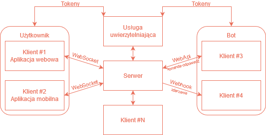

# Połączenie



Z serwerem połączysz się na dwa sposoby: przez **WebSocket** (dwukierunkowy, w czasie rzeczywistym) lub przez
**WebAPI** (klasyczne HTTP w modelu żądanie–odpowiedź). Oba korzystają z tego samego
[protokołu opartego o komunikaty JSON](protocol.md), więc kod budujący komendy jest wspólny.

| | WebSocket | WebAPI |
|---|---|---|
| Odbiór zdarzeń w czasie rzeczywistym | tak | nie |
| Jedno żądanie = jedna komenda | nie (multipleksowanie) | tak |
| Utrzymuje sesję i obecność użytkownika | tak | nie |
| Typowe zastosowanie | boty, klienty czatu, mostki | zadania cykliczne, skrypty CI, webhooki |

**Rekomendacja dla botów:** użyj WebSocket. Bot moderacyjny czy automatyzacja musi reagować na zdarzenia, a nie
odpytywać serwer; dodatkowo unikasz narzutu wielokrotnego uwierzytelniania HTTP. WebAPI sprawdza się tam, gdzie
utrzymywanie procesu jest niewygodne (funkcje bezserwerowe, cron).

## Token dostępowy

Do połączenia potrzebny jest token dostępowy. Uzyskasz go, wysyłając dane logowania do usługi uwierzytelniającej
metodą POST na adres `https://polfan.pl/webservice/auth/token`:

```json
{
    "login": "login_do_konta",
    "password": "hasło_do_konta",
    "client_name": "nazwa_programu"
}
```

Odpowiedź 200:

```json
{
    "token": "token_dostępowy",
    "expiration": "data_wygaśnięcia"
}
```

Odpowiedź 401 przy nieprawidłowych danych:

```json
{
    "errors": ["Invalid login or password"]
}
```

`client_name` trafia do listy sesji użytkownika – podaj rozpoznawalną nazwę swojej integracji.

!> Token wykorzystuj do momentu wygaśnięcia lub usunięcia. Liczba aktywnych tokenów na użytkownika jest ograniczona,
więc generowanie nowego przy każdym uruchomieniu procesu doprowadzi do wyczerpania limitu. Przechowuj token poza
repozytorium kodu.

## WebSocket

Adres połączenia:

```
wss://s2.polfan.pl/ws?token=token_dostępowy
```

### Parametry połączenia

| Parametr | Wymagany | Opis                                                                                              |
|----------|----------|---------------------------------------------------------------------------------------------------|
| `token`  | tak      | [token dostępowy](connection.md#token-dostępowy)                                                  |
| `p`      | nie      | platforma klienta: `web`, `ios`, `android`, `desktop`; zapisywana w [danych sesji](users.md#dane-sesji) |
| `ci`     | nie      | stały identyfikator instalacji klienta                                                            |
| `icts`   | nie      | tokeny powiązania tożsamości (do 10, po przecinku) – patrz [tożsamość](connection.md#tożsamość)   |

Komunikacja binarna nie jest wspierana – wysłanie ramki binarnej kończy się rozłączeniem ze zdarzeniem
[`Bye`](connection.md#bye).

### Zdarzenie `Session`

Po poprawnym uwierzytelnieniu serwer wysyła zdarzenie `Session` z pełnym stanem na moment połączenia. Wszystkie
kolejne zdarzenia modyfikują ten stan.

#### `Session`

| Pole            | Typ                                     | Opis                                                    |
|-----------------|-----------------------------------------|---------------------------------------------------------|
| `serverVersion` | `string`                                | wersja serwera                                          |
| `protoVersion`  | `string`                                | wersja protokołu (semver)                               |
| `state`         | [`UserState`](connection.md#userstate)  | przestrzenie i pokoje, w których jest użytkownik        |
| `user`          | [`User`](users.md#user)                 | zalogowany użytkownik                                   |
| `ict`           | `UUID`&#124;`null`                      | [token powiązania tożsamości](connection.md#tożsamość)  |

#### `UserState`

| Pole     | Typ                          | Opis                                            |
|----------|------------------------------|-------------------------------------------------|
| `spaces` | [`Space[]`](spaces.md#space) | przestrzenie, których użytkownik jest członkiem  |
| `rooms`  | [`Room[]`](rooms.md#room)    | pokoje, w których użytkownik jest obecny         |

Ten sam obiekt pobierzesz w dowolnym momencie komendą `GetSession` (bez pól). Jest to jedyna komenda, którą
warto wywołać samodzielnie po stronie WebAPI, aby poznać stan konta.

<details><summary>Przykład zdarzenia <code>Session</code></summary>

```json
{
  "meta": { "type": "Session", "ref": null },
  "data": {
    "serverVersion": "PolfanServer/1.4.0",
    "protoVersion": "0.2.0",
    "state": {
      "spaces": [
        {
          "id": "3dEUaR7YQ8mQ1L2pF5nKwz",
          "name": "Hogwart",
          "description": "Szkoła magii",
          "roles": [
            { "id": "5nKwz3dEUaR7YQ8mQ1L2pF", "priority": 0, "name": "everyone", "color": null }
          ],
          "systemRoom": null,
          "defaultRooms": [],
          "icon": null,
          "banner": null,
          "discoverable": "NotRequested",
          "flags": 0
        }
      ],
      "rooms": [
        {
          "id": "7hK9pQ2vXnR4tY6uW1sZbA",
          "spaceId": "3dEUaR7YQ8mQ1L2pF5nKwz",
          "name": "wielka-sala",
          "description": "",
          "type": "Text",
          "defaultTopic": { "id": "9wZbA7hK9pQ2vXnR4tY6uW", "name": "ogólny", "messageCount": 128 },
          "recipients": null,
          "flags": 1,
          "stream": null,
          "history": { "mode": "Full" }
        }
      ]
    },
    "user": {
      "id": "10493",
      "nick": "Skrzat",
      "avatar": "https://files.polfan.pl/f/abc",
      "tags": ["bot"],
      "status": 1,
      "online": true
    }
  }
}
```

</details>

### Utrzymanie połączenia

Serwer wspiera komendę `Ping` (bez pól), na którą odpowiada zdarzeniem `Pong` (bez pól). Zalecany schemat dla bota:

1. Po ~15 s ciszy na łączu wyślij `Ping`.
2. Jeśli `Pong` nie wróci w ciągu ~5 s, uznaj połączenie za martwe i rozłącz się.
3. Nawiąż połączenie ponownie z opóźnieniem wykładniczym (backoff).

Ping/pong protokołu WebSocket na poziomie ramek również działa, ale komenda `Ping` przechodzi przez pełną ścieżkę
aplikacyjną, więc wykrywa też zawieszenie samego serwera, nie tylko zerwane TCP.

### Ponowne połączenie

Po każdym połączeniu otrzymujesz nowe zdarzenie `Session` zawierające pełny stan. **Cache zbudowany na zdarzeniach
poprzedniego połączenia jest nieaktualny** – w czasie przerwy mogłeś przegapić dowolną liczbę zdarzeń. Po
rekonekcie:

* odbuduj listy przestrzeni i pokojów z pola `state`;
* pobierz ponownie dane, które trzymasz lokalnie (członkowie, uprawnienia, obserwowane tematy);
* nadrób historię komendą [`GetMessages`](messages.md#pobieranie-historii) z parametrem `after` i ostatnim znanym
  ID wiadomości.

### Zdarzenie `Bye`

Zanim serwer zerwie połączenie z własnej inicjatywy, wysyła zdarzenie `Bye` z powodem rozłączenia. Pozwala to
odróżnić sytuację przejściową (restart serwera – połącz się ponownie) od trwałej (ban – nie ponawiaj).

#### `Bye`

| Pole     | Typ                                       | Opis                |
|----------|-------------------------------------------|---------------------|
| `reason` | [`LeaveReason`](connection.md#leavereason) | powód rozłączenia  |

#### `LeaveReason`

Ten sam obiekt opisuje też opuszczenie [pokoju](rooms.md#wyjście-z-pokoju) i [przestrzeni](spaces.md#wyjście-z-przestrzeni).

| Pole      | Typ                                            | Opis                                                    |
|-----------|------------------------------------------------|---------------------------------------------------------|
| `type`    | `"Leave"`&#124;`"SpaceLeave"`&#124;`"Ban"`&#124;`"Kick"`&#124;`"Service"`&#124;`"Error"` | rodzaj powodu |
| `ban`     | [`BanObject`](moderation.md#banobject)&#124;`null` | wypełnione dla `Ban`                                |
| `kick`    | `string`&#124;`null`                           | powód wyrzucenia, dla `Kick`                            |
| `service` | `string`&#124;`null`                           | komunikat serwisowy, dla `Service`                      |
| `error`   | [`Error`](errors.md)&#124;`null`               | szczegóły błędu, dla `Error`                            |

| `type`       | Znaczenie                                                   | Co powinien zrobić bot                    |
|--------------|-------------------------------------------------------------|-------------------------------------------|
| `Leave`      | użytkownik wyszedł samodzielnie (np. z innej sesji)          | nie ponawiaj dla danego zasobu            |
| `SpaceLeave` | wyjście z pokoju wymuszone opuszczeniem przestrzeni          | zaktualizuj stan                          |
| `Ban`        | ban lub wyciszenie                                           | nie ponawiaj; sprawdź `ban.expiresAt`     |
| `Kick`       | wyrzucenie przez moderatora                                  | możesz wrócić, najlepiej z opóźnieniem    |
| `Service`    | restart, konserwacja, zamknięcie węzła                       | połącz ponownie z backoffem               |
| `Error`      | błąd protokołu lub uwierzytelniania                          | napraw klienta; przy `AuthenticationException` odśwież token |

### Tożsamość

Pole `ict` w zdarzeniu `Session` to token pozwalający serwerowi rozpoznać, że kilka kont należy do tej samej osoby.
Klient może zapamiętać otrzymane tokeny i podać je przy kolejnych połączeniach w parametrze `icts` (po przecinku,
maksymalnie 10). Mechanizm służy egzekwowaniu banów i jest opcjonalny – integracja obsługująca jedno konto może go
zignorować.

## WebAPI

Wszystkie żądania wysyłaj metodą **POST** na adres:

```
https://s2.polfan.pl/api
```

W ciele żądania umieść pojedynczą [kopertę komendy](protocol.md#format-wiadomości). Każde żądanie podpisz nagłówkiem:

```
Authorization: Bearer token_dostępowy
```

W odpowiedzi otrzymasz kopertę zdarzenia zwrotnego ze statusem HTTP 200 albo
[zdarzenie `Error`](errors.md#globalne-kody-błędów) z odpowiednim kodem HTTP.

Ograniczenia wynikające z modelu żądanie–odpowiedź:

* zwracane jest **tylko** zdarzenie skierowane do nadawcy; zdarzeń rozgłoszeniowych nie zobaczysz;
* komendy, których odpowiedź jest dostarczana asynchronicznie (`React`, `Ack`, `FollowTopic`, `CreateRoom`),
  nie mają czym wypełnić odpowiedzi – używaj ich przez WebSocket;
* obecność użytkownika nie zmienia się na `Online`.

## Limity

Serwer przetwarza komendy jednego klienta **równolegle, ale z ograniczeniem**: domyślnie 5 komend jednocześnie,
kolejne trafiają do kolejki (domyślnie do 1000 pozycji). Kolejność odpowiedzi nie jest gwarantowana – dopasowuj je
po [`ref`](protocol.md#identyfikator-referencyjny-ref).

Praktyczne konsekwencje dla bota masowo modyfikującego stan (np. nadającego role setkom osób):

* wysyłaj komendy partiami i czekaj na potwierdzenia, zamiast zalewać połączenie;
* nie zakładaj, że komenda wysłana wcześniej wykona się wcześniej – jeśli operacje są zależne, serializuj je sam.
