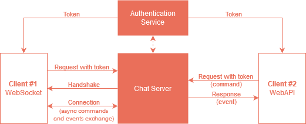

# Połączenie



**Serwer** — usługa czatu.

**Użytkownik/bot** — fizyczna osoba lub usługa mająca przypisane pojedyncze konto, identyfikująca się loginem i hasłem.

**Klient** — oprogramowanie nawiązujące połączenie z serwerem, reprezentujące użytkownika, identyfikowane za pomocą tokena.

## Token dostępowy

Aby nawiązać połączenie z serwerem, potrzebujesz tokena dostępowego. Uzyskasz go, wysyłając dane logowania do usługi uwierzytelniającej.

    POST https://polfan.pl/webservice/auth/token
    {
	    "login": "login_do_konta",
	    "password": "hasło_do_konta",
	    "client_name": "nazwa_programu"
    }

W przypadku poprawnego uwierzytelnienia w odpowiedzi otrzymasz token:

    HTTP 200
    {
	    "token": "token_dostępowy",
	    "expiration": "data_wygaśnięcia"
    }

W przypadku podania nieprawidłowych danych otrzymasz komunikat o błędzie:

    HTTP 401
    {
	    "errors": ['Invalid login or password']
    }

!> Przy stosowaniu tokenów mogą występować limity zależne od użytego sposobu komunikacji z serwerem. Więcej o tym przeczytasz niżej.

## WebAPI

WebAPI to usługa sieciowa pozwalająca na komunikację z serwerem w modelu żądanie-odpowiedź za pomocą protokołu HTTP. Za jej pomocą wyślesz do serwera komendy i otrzymasz informacje o ewentualnych błędach, jednak nie otrzymasz zdarzeń związanych z ich wykonaniem. Jeśli chcesz otrzymywać zdarzenia w modelu żądanie-odpowiedź, wykorzystaj webhooki.

Użyj WebAPI gdy:

 - chcesz w prosty sposób wysyłać wiadomości i wykonywać inne komendy,
 - nie potrzebujesz otrzymywać zdarzeń.

### Uwierzytelnianie

Token prześlij w nagłówku `Authorization: Bearer token_dostępowy`. 

### Komunikacja

Żądanie kieruj na adres: 

`https://s2.polfan.pl/api`

W jego ciele prześlij [poprawną komendę](protocol.md). W odpowiedzi możesz otrzymać:

| Kod HTTP | Zawartość                                                                                                                                                                                         |
|----------|---------------------------------------------------------------------------------------------------------------------------------------------------------------------------------------------------|
| `200`    | odpowiedź na komendę. W przypadku komend generujących zdarzenia, sporadycznie może to być zdarzenie (z powodu asynchronicznej natury serwera **nie ma na to żadnej gwarancji**)                   |
| `201`    | wiadomość bez zawartości. Oznacza, że komenda została poprawnie wykonana, a zdarzenie z informacją o modyfikacji stanu zostanie rozesłane do klientów (możesz je odebrać np. za pomocą webhooków) |

lub [wiadomość `Error` z odpowiednim kodem HTTP](errors.md#globalne-kody-błędów).

## Webhooki

W przygotowaniu.

Użyj webhooków gdy:

 - używasz WebAPI i chcesz otrzymywać wybrane zdarzenia,
 - posiadasz lub chcesz zbudować aplikację działającą w modelu request-response,
 - Twoja aplikacja posiada publiczny endpoint, do którego będą mogły być kierowane zdarzenia.

## WebSocket

Aby połączyć się z usługą możesz wykorzystać protokół [WebSocket](https://developer.mozilla.org/en-US/docs/Web/API/WebSocket). Za pomocą takiego połączenia możesz wysyłać komendy i otrzymywać wszystkie zdarzenia i odpowiedzi w czasie rzeczywistym.

Użyj połączenia websocket gdy:

- posiadasz/chcesz stworzyć aplikację, która jest w stanie utrzymywać (w razie potrzeby odnawiać) długotrwałe połączenie websocketowe,
- chcesz odbierać zdarzenia, ale nie chcesz wystawiać publicznego endpointu dla webhooków,
- chcesz uniknąć konieczności wykonywania/odbierania wielu zapytań HTTP.

### Uwierzytelnianie i komunikacja

Token prześlij w parametrze `token` przy nawiązywaniu połączenia z serwerem: 

`wss://s2.polfan.pl/ws?token=token_dostępowy`

Po prawidłowym uwierzytelnieniu serwer wykona inicjalizację połączenia (tzw. handshake) i wyśle wiadomość powitalną `Welcome` zawierającą stan sesji użytkownika.

#### `Welcome`

Zdarzenie zawierające pełną informację o stanie sesji na moment nawiązania połączenia. Wszelkie zdarzenia występujące od tej chwili będą modyfikować ten stan.

| Pole      | Typ                                | Opis                                  |
|-----------|------------------------------------|---------------------------------------|
| `session` | [`Session`](connection.md#session) | obiekt zawierający informacje o sesji |

#### `Session`

| Pole            | Typ                                            | Opis                                               |
|-----------------|------------------------------------------------|----------------------------------------------------|
| `serverVersion` | `string`                                       | wersja serwera z którym nastąpiło połączenie       |
| `global`        | [`GlobalConfig[]`](connection.md#globalconfig) | ustawienia globalne serwera                        |
| `spaces`        | [`Space[]`](spaces.md#space)                   | lista przestrzeni w których obecny jest użytkownik |
| `rooms`         | [`Room[]`](rooms.md#room)                      | lista pokojów w których obecny jest użytkownik     |

#### `GlobalConfig`

| Pole      | Typ                     | Opis                                  |
|-----------|-------------------------|---------------------------------------|

#### Przykład zdarzenia `Welcome`

```json
{
  "_": {
    "type": "Welcome"
  },
  "serverVersion": "PolfanServer/0.0.1",
  "global": {},
  "spaces": [
    {
      "id": "252e63a0-10cf-4856-bdcb-db2b2aadedd2",
      "basicData": {
        "name": "Hogwart"
      },
      "roles": [
        {
          "id": "252e63a0-10cf-4856-bdcb-db2b2aadedd2",
          "basicData": {
            "name": "Gryffindor",
            "color": "#ff0000"
          }
        }
      ],
      "members": [
        {
          "user": {
            "id": "1002",
            "basicData": {
              "nick": "Harry Potter",
              "avatar": ""
            }
          }, 
          "roles": ["252e63a0-10cf-4856-bdcb-db2b2aadedd2"]
        }
      ]
    }
  ],
  "rooms": [
    {
      "id": "252e63a0-10cf-4856-bdcb-db2b2aadedd2",
      "spaceId": "252e63a0-10cf-4856-bdcb-db2b2aadedd2",
      "basicData": {
        "name": "Zamek",
        "description": ""
      },
      "topics": {
        "id": "252e63a0-10cf-4856-bdcb-db2b2aadedd2",
        "basicData": {
          "name": "Wielka sala",
          "description": ""
        }
      },
      "members": [
        {
          "userId": "1002"
        }
      ]
    }
  ]
}
```